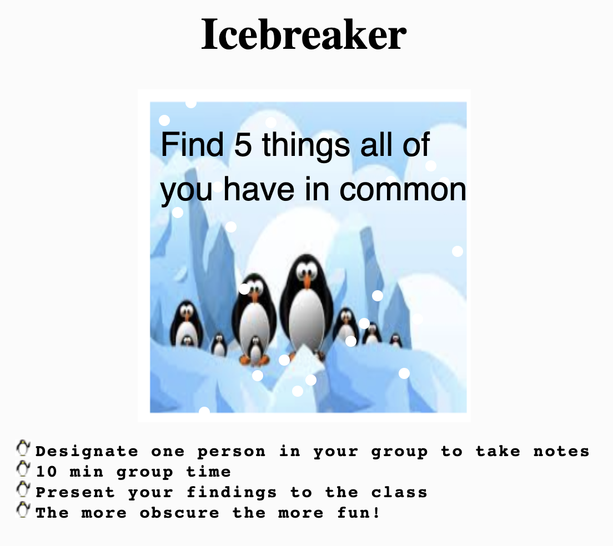

# p5-sketch-tutorial
<pre align="center"> 
  <h3>Let creativity fill your soul
  Let inspiration run through your veins
  Let's make art in any way possible
  And together
  Give the grey people a bit of our color</h3>
  
- Angela Simone -

</pre>
## Status - still in progress

## Contact
[![LinkedIn][linkedin-shield]](https://www.linkedin.com/in/cmb-charlean-baxter/)

<!-- TABLE OF CONTENTS -->

  
Table of Contents

  <ol>
    <li>
      <a href="#about-the-project">About The Project</a>
      <ul>
        <li><a href="#built-with">Built With</a></li>
      </ul>
    </li>
    <li>
      <a href="#getting-started">Getting Started</a>
      <ul>
        <li><a href="#prerequisites">Prerequisites</a></li>
      </ul>
    </li>
    <li><a href="#roadmap">Roadmap</a></li>
    <li><a href="#contact">Contact</a></li>
    <li><a href="#acknowledgments">Acknowledgments</a></li>
  </ol>

<!-- ABOUT THE PROJECT -->
## About The Project

Creativity is a wondrous tool in web development. The more we as developers expose ourselves to different approaches, the more effective and exciting our applications become. This colorful notion of expressive coding lives vividly in p5.js.

p5.js is a free and open-source JavaScript library that makes coding accessible to everyone. This creative software allows a browser page to be used as a drawing canvas. Its functionality goes beyond the sketchpad and allows interaction with other HTML elements, such as text, user inputs, videos, and sounds.
<!-- PROJECT LOGO -->
 

  
<h3 align="center">p5 Sketch Tutorial</h3>
  

    Through the use of p5.js, a static page was transformed into one that has snow falling, text that flies around, and instructions that enter with a typewriter effect.
     
    <a href="https://github.com/SunkissedQueen/p5-sketch-tutorial"><strong>Explore the docs »</strong></a>
     
     
    <a href="https://sunkissedqueen.github.io/p5-sketch-tutorial/">View Demo</a>
  

  
### Built With
* [p5.js](https://happycoding.io/tutorials/p5js/)
* [html](https://www.w3schools.com/html/)
* [css](https://www.w3schools.com/w3css/defaulT.asp)

(<a href="#top">back to top</a>)

<!-- GETTING STARTED -->
## Getting Started
To get a local copy up and running follow these [steps](https://p5js.org/get-started/).

### Prerequisites
* [p5.js web editor](https://editor.p5js.org/)
* [p5.js reference](https://p5js.org/reference/)
* [p5.js tutorials](https://happycoding.io/tutorials/p5js/)

(<a href="#top">back to top</a>)

<!-- USAGE EXAMPLES -->

## Usage
Additional screenshots, code examples and demos work well in this space. You may also link to more resources.
_For more examples, please refer to the [Documentation](https://showcase.p5js.org/#/2021-All)_

(<a href="#top">back to top</a>)

<!-- ROADMAP -->

## Roadmap
- [x] Add LinkedIn
- [x] Add back to top links
- [ ] Add Additional Templates w/ Examples
- [ ] Contributions

<!-- ACKNOWLEDGMENTS -->

## Acknowledgments

* [GitHub Pages](https://pages.github.com)
* [Best README Template](https://github.com/othneildrew/Best-README-Template)
* [GitHub Emoji Cheat Sheet](https://www.webpagefx.com/tools/emoji-cheat-sheet)
* [Malven's Flexbox Cheatsheet](https://flexbox.malven.co/)
* [Malven's Grid Cheatsheet](https://grid.malven.co/)
* [Img Shields](https://shields.io)

* [Happy Coding](https://happycoding.io/tutorials/p5js/)

* [Word Animation p5js](https://erraticgenerator.com/blog/animate-word-by-word-in-p5js/)

* [Coding Train GitHub Pages](https://www.youtube.com/watch?v=ZneWjyn18e8)

* [W3Schools](https://www.w3schools.com)

* [Typewriter Text Animation](https://www.w3docs.com/snippets/css/how-to-create-a-typewriter-text-with-only-css.html)

[linkedin-shield]: https://img.shields.io/badge/-LinkedIn-black.svg?style=for-the-badge&logo=linkedin&colorB=555

(<a href="#top">back to top</a>)

